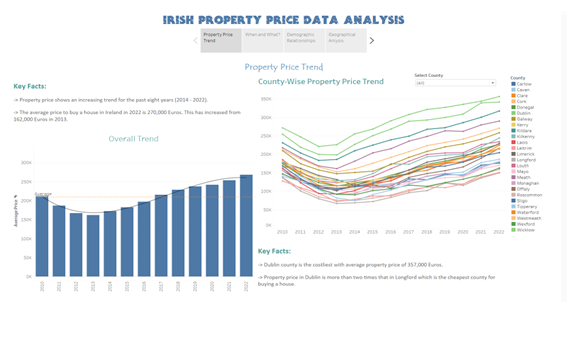
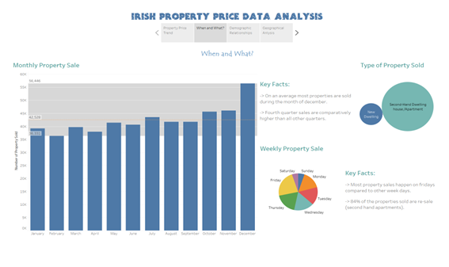
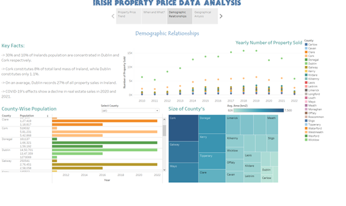
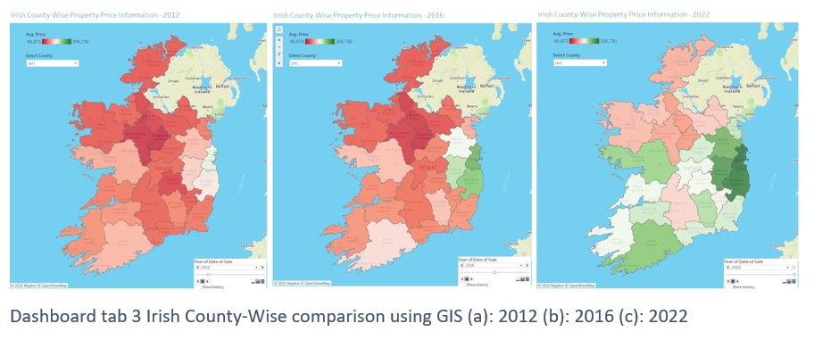
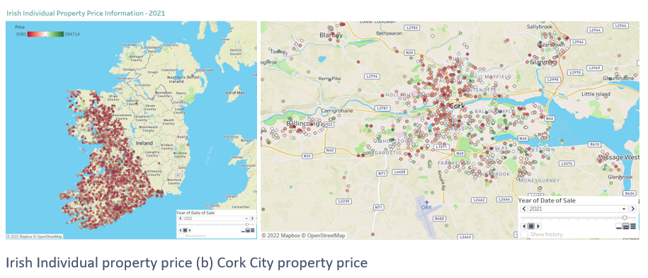

# PSRA-Property-Price-Register-Analysis-Tableau

Tableau Dashboard:
https://public.tableau.com/views/Property_Price_Analysis_GIS_16878638987420/Story1?:language=en-GB&:display_count=n&:origin=viz_share_link

## Property price trend

The Irish property price trend was analysed using bar plots and line graphs. Figure shows the tab1 of the dashboard. The average property price in Ireland has been steadily increasing for the past 8 years (2014 - 2022). Prior to 2013, Ireland's property values experienced a sharp decline from 2010 to 2013, which can be directly attributed to the global economic crisis that began in 2008. The country began to emerge from the crisis in 2012, and as a result, prices began to rise. The demand for housing surged as a result of various other causes, including less availability of properties and a significantly high demand due to reasons like influx of immigrants from other counties.

The average price to buy a property in Ireland in 2022 is 268,325 Euros. While the overall average price for the 12-year period stood at 209,728 Euros. Dublin is the costliest county in Ireland with the average property rice in 2022 being 356,730 Euros. Longford and Leitrim are the cheapest counties to buy a house with an average property price around 150,000 Euros.
The difference in pricing between counties can be observed from the interactive line graph in the Figure. Overall, Dublin costs more than twice as much as the least expensive county in Ireland to buy a house.

## When and What?

To determine the ideal time to purchase or sell a property, a time-based study was carried out. This can be understood based on popularity trends by identifying the peak property selling season. Figure shows the tab 2 of the dashboard, which consists of two main details. Firstly, the average number of properties sold during each month over the past 12 years is shown in a bar graph. On average 42,528 houses are sold every month. The third quarter (October, November and December) of a year always accounts for above average property sales. Further it shows that property sale peaks during December and slows down during the first three months of a year, especially during February.

This information is essential for both buyers and sellers because it enables buyers to understand the best time with more properties available to choose from and the time period with less demand to get a good deal. For a seller this information helps to understand the best time with peak demand to sell their property to get more profit. Secondly, the bubble chart shows the difference in the type of properties sold. A total of 510,330 properties have been sold in the last 12 years, in which 84% accounts for second hand apartments. This information is crucial because it shows that even if there are many property sales happening, resales are majority category. This shows that the housing crisis is imminent and prices of property will be rising because, despite rising demand, there are not enough newly built homes to meet it.

## Demographic Relationships

The economy based demographic information is an important factor which determines how the real-estate market fares in a region. Figure 14 which depicts tab 3 of the dashboard, compares the population of each county in Ireland with the land area and the total number of property sales. Increased population is likely to result in a huge real estate market with high property sales. From Figure it can be observed that Ireland also performs as expected. Out of the total population of 4.9 million in Ireland, 30% of the people reside in Dublin followed by Cork County which houses 10% of Irish residents. In relationship with this 27% and 11% of all the property purchases in Ireland happens in Dublin and Cork respectively.
A significantly contrasting picture is revealed when the counties' populations and sizes are compared. While Cork and Galway are the biggest counties in Ireland in terms of area, Dublin is one of the smallest which constitutes only 1.1 % of the total land mass of Ireland. Which reveals that around 27% of Irelands property sale transactions happen within just 1.1% area. Galway County, which is about 7 times larger than Dublin, has an 8 times lower total property sale than Dublin. Counties like Donegal and Mayo are comparatively 5 to 6 times bigger than Dublin, while the number of properties sold every year is 15 times lesser.
From Figure 1 it can be observed that, the price of property in Ireland are exorbitantly high in few counties like Dublin while in majority of other regions its comparatively less. This when compared with Figure above is due to overpopulation in certain cities like Dublin and Cork. Due to very high demand and less supply the price rises up in these regions. For people to find better employment and live in other counties and relieve the high pressure on cities like Dublin and Cork to house the majority of the population, the country's economic growth and infrastructure development must be more widespread.

## Grographic Analysis

Figure (Tab 4 of the dashboard) shows the Irish county-based property price information in three different years (2012, 2016 and 2022). Dark red colour coding denotes a low average property price, whereas dark green colour coding denotes a very high property price. The shifting dynamics can be clearly seen in the image with increasing average property price in
each county. Ove the last 6 years (2016 - 2022) the prices have increased drastically in many counties. The overall pattern in Ireland is such that, the North-Eastern (Dublin and its sub-urban counties) are very high in terms of property price, while in North and North western counties the prices are still below average. The central and southern Ireland maintains an average range, with Cork and Galway being an exception with above average price range.

In 8 counties in the south and south-western provinces of Ireland, the addresses of the properties were geo-coded, and each property was plotted individually. Figure depicts
the map with individual properties from the year 2021. This map will help in clustering of properties and pattern recognition within a very small region.

As an area of interest, Cork city was focused and presented in the Figure. As per the properties sold in 2021 in Cork city, the property price varies in all ranges. Based on the pattern, Ballinlough and Bishoptown accounts for most of the highly priced property sale. While, region around Ballincollig and Douglas are nominal with average price. The north of cork city centre is the cheapest place to buy a property, especially around the township of Churchfield and Blackpool.
