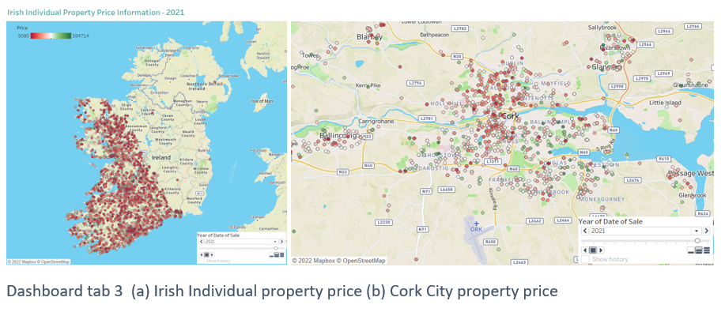

# PSRA-Property-Price-Register-Analysis-Tableau

<<<<<<< HEAD

## Property price trend
=======
Tableau Dashboard:
https://public.tableau.com/views/Property_Price_Analysis_GIS_16878638987420/Story1?:language=en-GB&:display_count=n&:origin=viz_share_link

Snaps of Tabs from the Dashboard:

>>>>>>> 8c4d11c43f53f59c36c182ac23aa9650ccf5a050

The Irish property price trend was analysed using bar plots and line graphs. Figure shows the tab1 of the dashboard. The average property price in Ireland has been steadily increasing for the past 8 years (2014 - 2022). Prior to 2013, Ireland's property values experienced a sharp decline from 2010 to 2013, which can be directly attributed to the global economic crisis that began in 2008. The country began to emerge from the crisis in 2012, and as a result, prices began to rise. The demand for housing surged as a result of various other causes, including less availability of properties and a significantly high demand due to reasons like influx of immigrants from other counties.

